# Markdown Mermaid preview test

Fixture for fenced `mermaid` blocks in the workspace editor and terminal sheet preview. Each diagram uses **mock Zedra product content** (realistic labels, not empty boxes).

**Copy to a connected host:**

```bash
scp examples/mermaid.md your-host:/tmp/zedra-mermaid-test.md
# In the terminal, tap: /tmp/zedra-mermaid-test.md:1
```

Scroll the full file. Expect rendered diagrams (not monospace fences). Use **Show source** under a card to verify selection maps to the fence.

**Note:** Do not put Markdown code fences (three backticks) inside a `mermaid` fence.

---

## Flowchart — open README.md from terminal

Scenario: user taps an OSC-8 link to vendor/zed/README.md while zedra-host is connected.

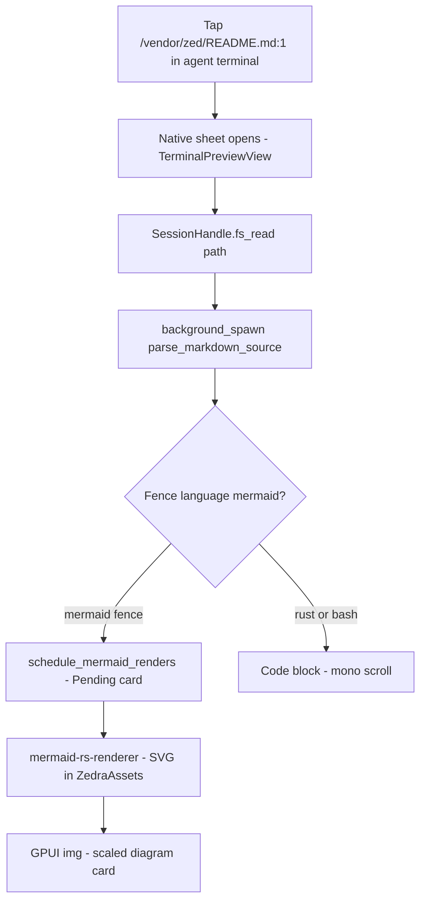

## Flowchart — session data path (LR)

Scenario: remote markdown bytes become pixels on the phone.

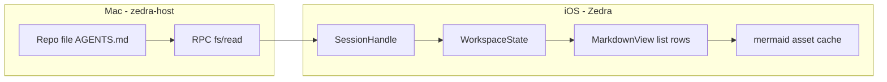

## Sequence — preview sheet load

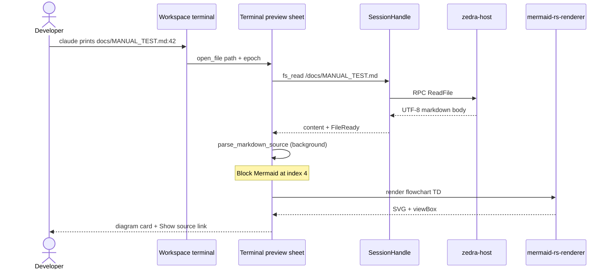

## Class — markdown preview model

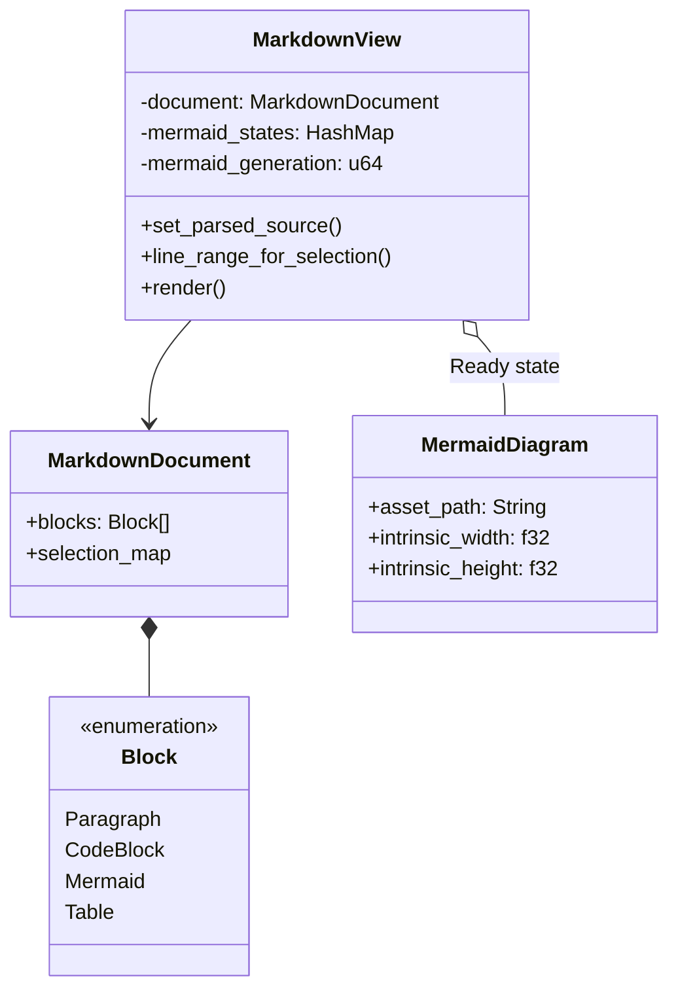

## State — Mermaid block lifecycle

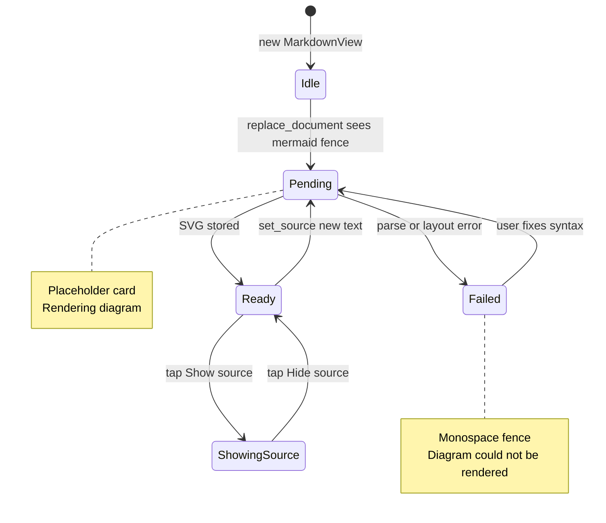

## ER — workspace on device

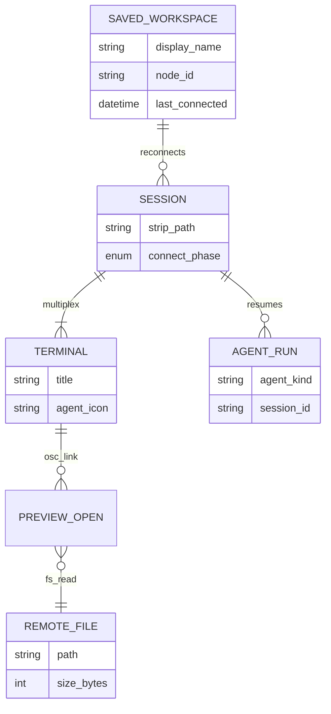

## Pie — time in workspace (mock telemetry)

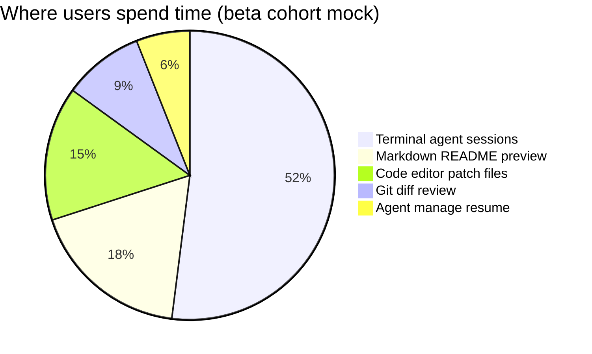

## Gantt — Mermaid preview rollout (fiction)

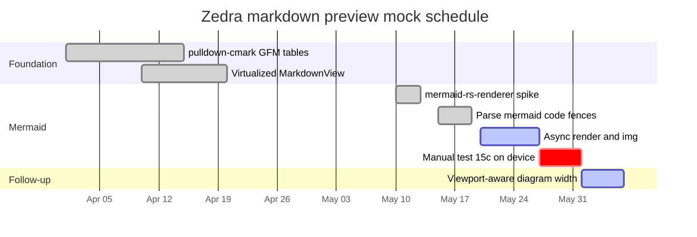

## Git graph — feature branch (mock)

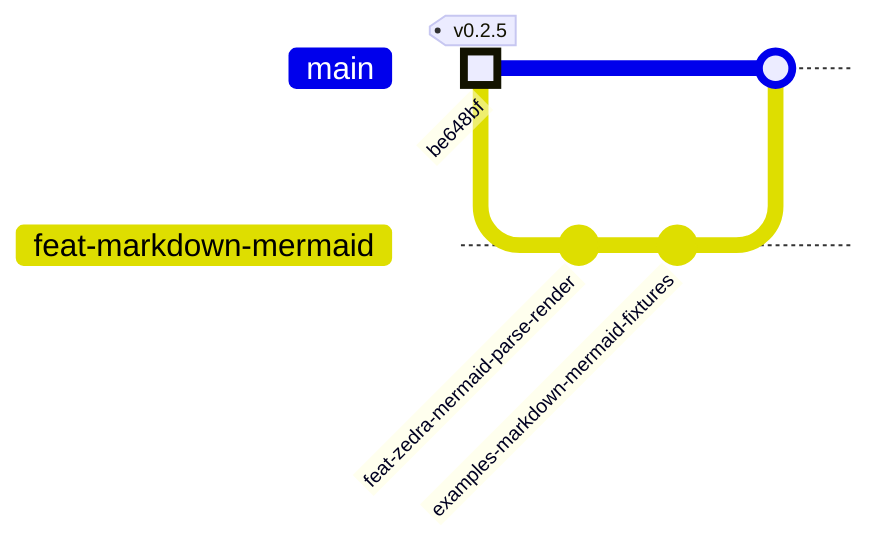

## Mindmap — Zedra mobile surface area

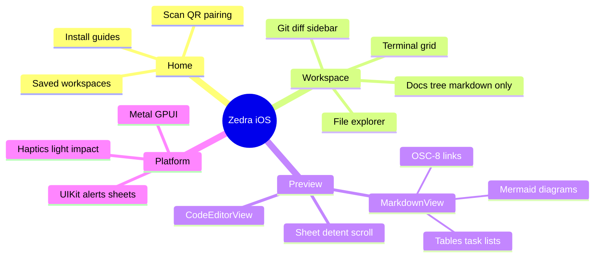

## Journey — first Mermaid README (mock persona)

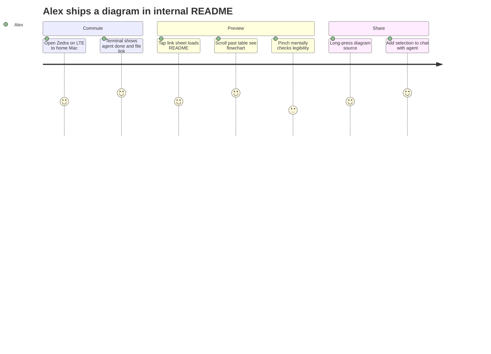

## Timeline — markdown capabilities

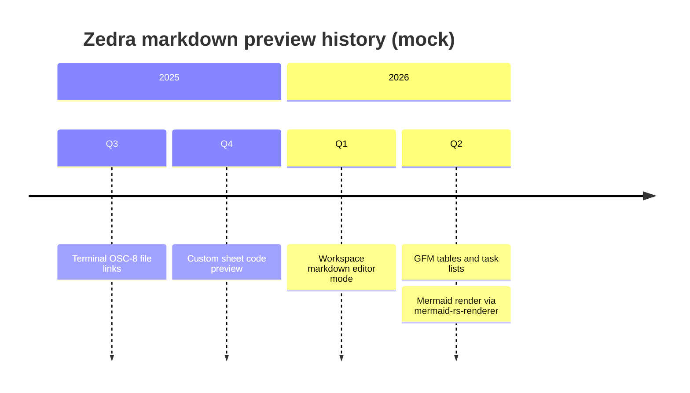

## Quadrant — diagram renderers considered

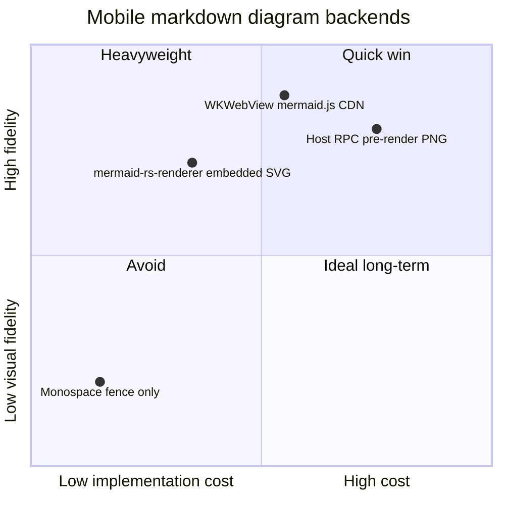

## XY chart — preview scroll FPS vs doc size (mock)

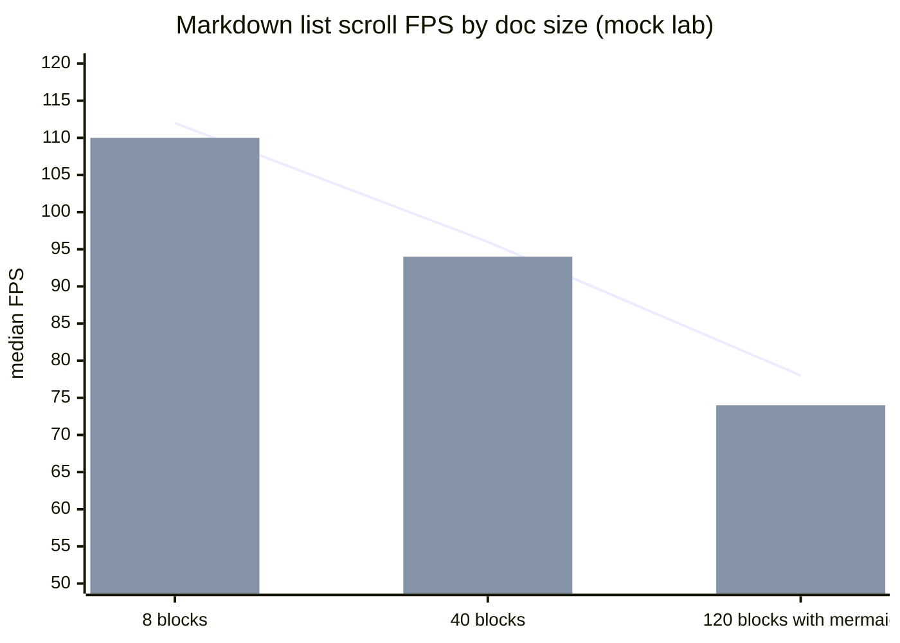

## Sequence — stale render guard

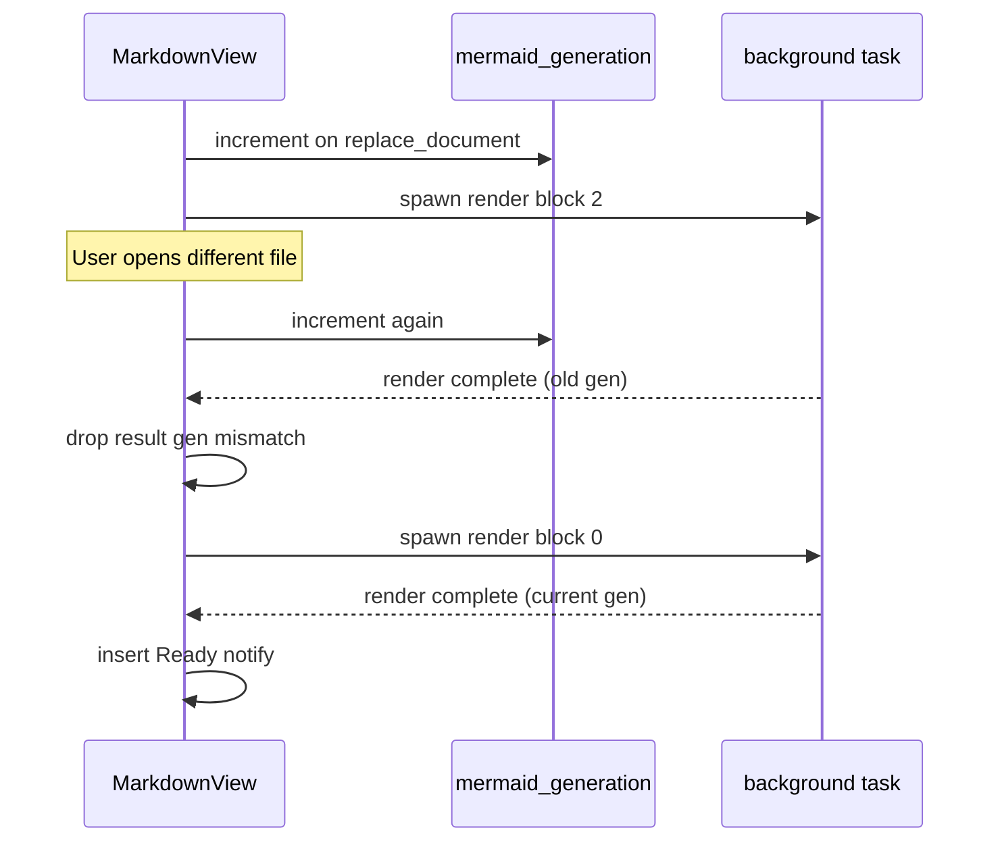

## Intentional failure (fallback)

Invalid syntax — expect monospace fence plus error line.

```mermaid
diagram-type-that-does-not-exist
  Zedra --> should not render
```

## Control — Rust fence (not Mermaid)

```rust
// This block must stay a horizontal-scroll code card.
pub fn is_markdown_path(path: &str) -> bool {
    path.ends_with(".md") || path.eq_ignore_ascii_case("readme")
}
```
